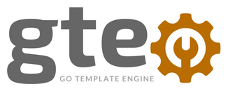

# go-template-engine GTE



Based on Golang templates text SDK.

## TLDR;

- Added static file include. Tag {{staticInclude "path/to/file.txt"}}
- Added replace tag. Tag {{replace .var "FROM_THIS" "TO_THIS"}}
- Accepts JSON and YAML variables files
- Lookup on file extension and parses accordingly, accepts **.json .yml .yaml** extensions
- Custom variable delimeter can be set using flags. Default: {{ , }}. Left and Right respectively. Check help menu.
- If --source points to a directory, it will run recursively, keeping the directory structure. Good for scaffolding
- Accepts multiple variables files, merging them. YAML only. (It will override duplicated variables if the exits in more than one file)
- These examples are pretty vanilla, go templates are actually pretty powerful, check the links for more info.
    - [https://astaxie.gitbooks.io/build-web-application-with-golang/content/en/07.4.html](https://astaxie.gitbooks.io/build-web-application-with-golang/content/en/07.4.html)
    - [https://golang.org/pkg/text/template/](https://golang.org/pkg/text/template/)
- Can be extended
    - ```$> go get github.com/marcelocorreia/go-template-engine/template-engine```

### Options
```
$> go-template-engine --help
  usage: go-template-engine --source=SOURCE [<flags>]

  Flags:
        --help                   Show context-sensitive help (also try --help-long and --help-man).
    -s, --source=SOURCE          Template Source File
        --var=VAR ...            Params & Variables. Example --var hey=ho --var lets=go
        --var-file=VAR-FILE ...  Variables File
        --exclude-dir=EXCLUDE-DIR ...
                                 Variables File
    -o, --output=OUTPUT          File output full path
        --delim-left="{{"        Left Delimiter
        --delim-right="}}"       Right Delimiter
    -v, --version                App Version
```

### Usage
files in the examples are located at template-engine/test_fixtures/
```
$> go-template-engine run --source template-engine/test_fixtures/cfn.tpl.yml \
        --var-file template-engine/test_fixtures/cfn-vars.yml \
        --output cfn.yml

$> go-template-engine run --source template-engine/test_fixtures/cfn.tpl.yml \
        --var-file template-engine/test_fixtures/cfn-vars.json \
        --output cfn.yml
```

### Install
Mac OS
```bash
$> brew tap marcelocorreia/homebrew-taps
   brew install go-template-engine
```
Other Systems Download latest binary from [https://github.com/marcelocorreia/go-template-engine/releases](https://github.com/marcelocorreia/go-template-engine/releases)


### Examples

#### Simple CFN Template
```yaml
AWSTemplateFormatVersion: 2010-09-09
Description: VPC's sample

Resources: {{range .network.vpcs}}{{$vpc_name := .name}}
  {{.name}}:
    Type: 'AWS::EC2::VPC'
    Properties:
      EnableDnsSupport: 'true'
      EnableDnsHostnames: 'true'
      CidrBlock: {{.cidr}}
      Tags:
        - Key: Application
          Value: !Ref 'AWS::StackName'
{{range .subnets}}
  {{.name}}:
    Type: 'AWS::EC2::Subnet'
    Properties:
      VpcId: !Ref {{$vpc_name}}
      CidrBlock: {{.cidr}}
      Tags:
        - Key: Application
          Value: !Ref 'AWS::StackName'
{{end}}{{end}}
Outputs: {{range .network.vpcs}}
  {{.name}}:
    Description: VPC ID of {{.name}}
    Value: !Ref {{.name}}
{{range .subnets}}
  PrivateSubnet:
    Description: Subnet ID of {{.name}}
    Value: !Ref {{.name}}
{{end}}
{{end}}
```

#### YAML Variables
```yaml
network:
  vpcs:
    - name: VPCA
      cidr: 10.11.0.0/16
      subnets:
        - name: SubnetA1
          cidr: 10.11.1.0/24
        - name: SubnetA2
          cidr: 10.11.2.0/24
    - name: VPCB
      cidr: 10.12.0.0/16
      subnets:
        - name: SubnetB1
          cidr: 10.12.1.0/24
        - name: SubnetB2
          cidr: 10.12.2.0/24
```
#### JSON Variables
```json
{
  "network": {
    "vpcs": [
      {
        "cidr": "10.11.0.0/16",
        "name": "VPCA",
        "subnets": [
          {
            "cidr": "10.11.1.0/24",
            "name": "SubnetA1"
          },
          {
            "cidr": "10.11.2.0/24",
            "name": "SubnetA2"
          }
        ]
      },
      {
        "cidr": "10.12.0.0/16",
        "name": "VPCB",
        "subnets": [
          {
            "cidr": "10.12.1.0/24",
            "name": "SubnetB1"
          },
          {
            "cidr": "10.12.2.0/24",
            "name": "SubnetB2"
          }
        ]
      }
    ]
  }
}
```
#### Output
```yml
AWSTemplateFormatVersion: 2010-09-09
Description: VPC's sample

Resources:
  VPCA:
    Type: 'AWS::EC2::VPC'
    Properties:
      EnableDnsSupport: 'true'
      EnableDnsHostnames: 'true'
      CidrBlock: 10.11.0.0/16
      Tags:
        - Key: Application
          Value: !Ref 'AWS::StackName'

  SubnetA1:
    Type: 'AWS::EC2::Subnet'
    Properties:
      VpcId: !Ref VPCA
      CidrBlock: 10.11.1.0/24
      Tags:
        - Key: Application
          Value: !Ref 'AWS::StackName'

  SubnetA2:
    Type: 'AWS::EC2::Subnet'
    Properties:
      VpcId: !Ref VPCA
      CidrBlock: 10.11.2.0/24
      Tags:
        - Key: Application
          Value: !Ref 'AWS::StackName'

  VPCB:
    Type: 'AWS::EC2::VPC'
    Properties:
      EnableDnsSupport: 'true'
      EnableDnsHostnames: 'true'
      CidrBlock: 10.12.0.0/16
      Tags:
        - Key: Application
          Value: !Ref 'AWS::StackName'

  SubnetB1:
    Type: 'AWS::EC2::Subnet'
    Properties:
      VpcId: !Ref VPCB
      CidrBlock: 10.12.1.0/24
      Tags:
        - Key: Application
          Value: !Ref 'AWS::StackName'

  SubnetB2:
    Type: 'AWS::EC2::Subnet'
    Properties:
      VpcId: !Ref VPCB
      CidrBlock: 10.12.2.0/24
      Tags:
        - Key: Application
          Value: !Ref 'AWS::StackName'

Outputs:
  VPCA:
    Description: VPC ID of VPCA
    Value: !Ref VPCA

  PrivateSubnet:
    Description: Subnet ID of SubnetA1
    Value: !Ref SubnetA1

  PrivateSubnet:
    Description: Subnet ID of SubnetA2
    Value: !Ref SubnetA2


  VPCB:
    Description: VPC ID of VPCB
    Value: !Ref VPCB

  PrivateSubnet:
    Description: Subnet ID of SubnetB1
    Value: !Ref SubnetB1

  PrivateSubnet:
    Description: Subnet ID of SubnetB2
    Value: !Ref SubnetB2
```

#### Static Include
```yaml
---
list:
{{staticInclude "test_fixtures/list1.txt"}}
```
##### Result
```yaml
---
list:
  - hey
  - ho
  - lets
  - go
```
#### whatever else...
```text
# {{.package_name}}

{{.phrase1}}
{{.phrase1}}

They're forming in a straight line
They're going through a tight wind
The kids are losing their minds
The Blitzkrieg Bop

They're piling in the back seat
They're generating steam heat
Pulsating to the back beat
The Blitzkrieg Bop.

{{.phrase1}}
Shoot'em in the back now
What they want, I don't know
They're all reved up and ready to go

{{.the.end}}
```

```
package_name: Blitzkrieg Bop
phrase1: Hey ho, let's go
the: {end: Tommy & Dee Dee Ramone}
```

```markdown
# Blitzkrieg Bop

Hey ho, let's go
Hey ho, let's go

They're forming in a straight line
They're going through a tight wind
The kids are losing their minds
The Blitzkrieg Bop

They're piling in the back seat
They're generating steam heat
Pulsating to the back beat
The Blitzkrieg Bop.

Hey ho, let's go
Shoot'em in the back now
What they want, I don't know
They're all reved up and ready to go

Tommy & Dee Dee Ramone
```

#### Simple vars passed on call
```bash
$> go-template-engine --source template-engine/test_fixtures/simple.txt.tpl \
    --var easy=simple \
    --var who=we
```

## Development

```bash
$> go get github.com/marcelocorreia/go-template-engine/template-engine
```

```golang
var engine template_engine.Engine
engine = template_engine.TemplateEngine{}
file, _ := ioutil.ReadFile("test_fixtures/bb.json")
var varsJson interface{}
json.Unmarshal(file, &varsJson)
outJson, _ := engine.ParseTemplateFile("test_fixtures/bb.txt.tpl", varsJson)
```


### TODO's
- [x] Accept multiple variable files
- [x] Recursive processing
- [x] Custom Delimeters
- [x] Static Include tag
- [x] Replace tag